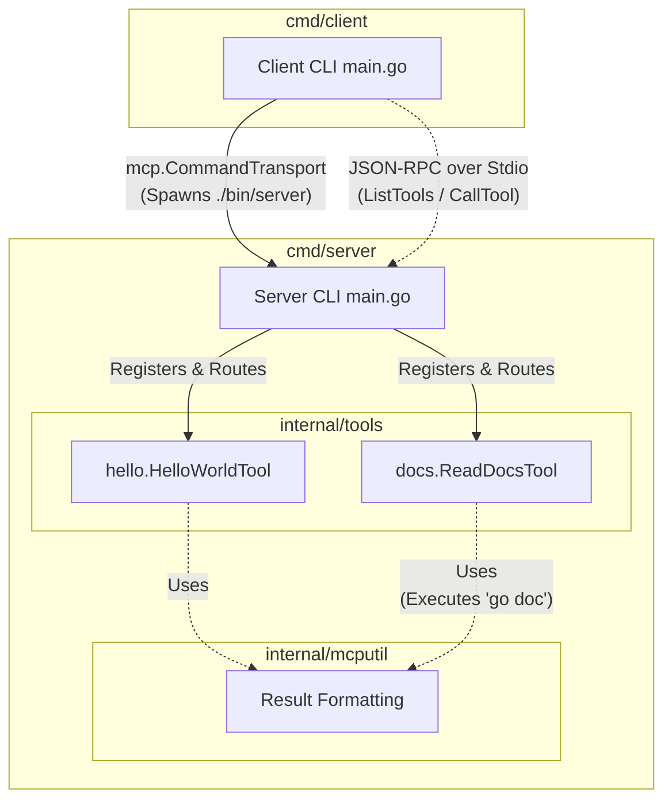

# Explanation of Source Code Structure Based on MCP Server
## 1. Architectural Diagram

Below is a diagram illustrating the interaction between components in the MCP framework:

## 2. Codebase Structure to MCP Mapping (Table)
|Directory / File   |MCP Concept    |Description    |
|:-                 | :-            |:-             |
|cmd/server/main.go |MCP Server     |Entry point for the server. Initializes mcp.Server, registers tools, and listens on stdio.|
|cmd/client/main.go |MCP Client     |Entry point for the client. Spawns the server binary and communicates via mcp.CommandTransport.|
|internal/tools/hello/|Tool         |Implements the hello_world tool with its name, description, and logic.|
|internal/tools/docs/|Tool          |Implements the read_docs tool, wrapping the go doc command.|
|internal/mcputil/  |Utility/Helpers|Provides helper functions for formatting tool results into MCP-compatible structures.|

## 3. Detailed Component Breakdown
### MCP Server (cmd/server)
- Acts as the resource and tool provider.
- Waits for JSON-RPC messages over standard input/output.
- Maps tool names to their corresponding Go functions.

### MCP Client (cmd/client)
- Acts as the consumer.
- CLI tool where users can request actions (e.g., list tools or call a specific tool).
- Spawns the server binary as a child process and communicates directly.

### Tools (internal/tools)
- hello_world: A simple tool to verify the connection.
- read_docs: Executes the go doc command and returns the output.

### Utilities (internal/mcputil)
- Provides helper functions for formatting raw tool outputs into MCP-compatible results.